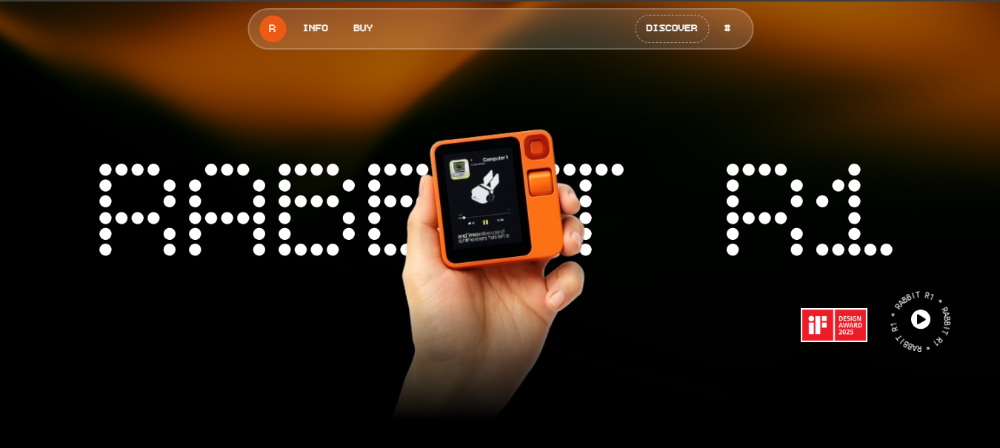
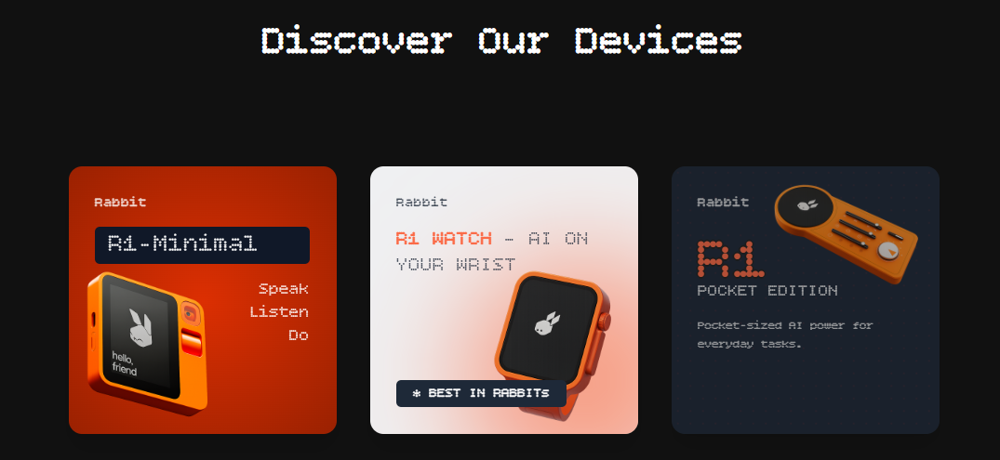
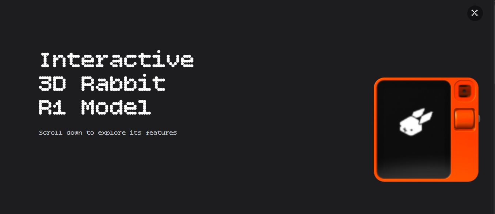

# Rabbit R1 – A Modern AI Companion 🐰

A sleek, animated landing page for the **Rabbit R1** – a conceptual AI device. Created during the **Sheryians Cohort Hackathon**, this project delivers a visually engaging and interactive experience using modern web technologies.




## ✨ Features

* 🎮 **3D Device Viewer** with [Spline](https://spline.design/)
* 🎞️ **GSAP Animations** for scroll effects & transitions
* 🌀 **Smooth Scrolling** using [Lenis](https://lenis.studiofreight.com/)
* 🖱️ **Dynamic Image Trail** that follows cursor movement
* 🧩 **Component-Based UI** with React
* 📱 **Fully Responsive** design with Tailwind CSS

## 🛠️ Tech Stack

| Category       | Tools & Libraries                                                                             |
| -------------- | --------------------------------------------------------------------------------------------- |
| **Framework**  | [React.js](https://react.dev/)                                                                |
| **Styling**    | [Tailwind CSS](https://tailwindcss.com/)                                                      |
| **Animation**  | [GSAP](https://gsap.com/), [Framer Motion](https://www.framer.com/motion/)                    |
| **3D Viewer**  | [@splinetool/react-spline](https://github.com/splinetool/react-spline)                        |
| **Scrolling**  | [Lenis](https://lenis.studiofreight.com/)                                                     |
| **Icons**      | [React Icons](https://react-icons.github.io/react-icons/), [Lucide React](https://lucide.dev) |
| **UI Library**      | [React Bits](https://reactbits.dev/) |
| **Build Tool** | [Vite](https://vitejs.dev/)                                                                   |

## 🚀 Getting Started

### Prerequisites

Ensure **Node.js** and **npm** (or yarn/pnpm) are installed.

### Installation

```bash
git clone https://github.com/developerchetram/sheryians_hackathon.git
cd sheryians_hackathon/
npm install     # or yarn install
npm run dev     # Runs the local server at http://localhost:5173
```

## 📁 Project Structure

```
├── public/              # Static assets
├── src/                 # Source code
│   ├── components/      # Reusable components (Navbar, Products, etc.)
│   ├── App.jsx          # Main App component
│   ├── index.css        # Global styles
│   └── main.jsx         # Entry point
├── package.json
└── index.html
```

## 🤝 Contributing

Your ideas and improvements are welcome!

```bash
# Fork → Clone → Create Branch → Commit → Push → PR
git checkout -b feature/YourFeature
```

## 👤 Author

**Chetram Patel** – [GitHub](https://github.com/DeveloperChetram)

## 📄 License

Licensed under the **MIT License** – see [LICENSE.md](LICENSE.md) for details.

---
